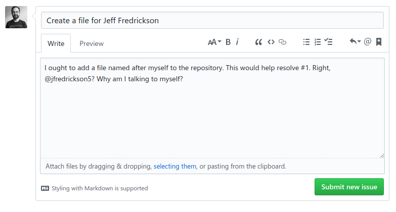

# Lab 1: Issues

## Introduction

GitHub provides a mechanism for tracking tasks, called *issues*. An issue is a general-purpose way of tracking enhancement requests, bug reports, tasks, or any other form of work that can be done on a project hosted at GitHub.

Working with issues is a simple, and yet useful, way you can contribute to an open source project. Issues also give you a way to track work on your own GitHub repositories.

## Exercise 1: Explore a repository's issues

Throughout this class, we'll be practicing on this GitHub repository: https://github.com/jfredrickson5/code-along (right-click this link and open it in a new tab or new window so that you can switch between the lab instructions and the code-along repository).

That repository contains our budding new open source project, so it's not much to look at right now.

Let's take a look at the issues by clicking on the **Issues** tab at the top of the repository. You should now see a list of issues.

Right now, there's only one issue, titled "[Add some files for the class to work on](https://github.com/jfredrickson5/code-along/issues/1)". Take a look at it. Someone's complaining that the repo is pretty bare. It's true, there's not much in this repo right now. We'll fix that throughout these labs.

## Exercise 2: Create a new issue

1. Make sure you are on the `jfredrickson5/code-along` repository (not the `GSA/training-pathway-data-practitioner` repository).

2. Click the **New issue** button.

3. Give the issue a title that you'll be able to remember later.

4. Type a brief but useful description. See the screenshot below for an example.

5. In the description, link to issue #1 simply by typing `#1` somewhere in the description. GitHub will automatically link to that issue number. See the screenshot below for an example.

6. In the description, refer to another GitHub user by using the @ symbol. Type `@jfredrickson5` somewhere in the description. See the screenshot below for an example.

7. Preview your issue by clicking on the "Preview" tab in the new issue form. This will help you confirm that your issue is correctly linking to issue #1 and the other GitHub user.

8. When your issue looks ready to go, click **Submit new issue**.

You should now see your new issue. There will be a comment field below it, allowing anyone to comment on your issue.

## Takeaways

* You were able to create a new issue in a public repository owned by someone else. They didn't have to give you special access to do so. This encourages open collaboration.

* You can refer to other issues and other GitHub users by using `#` and `@`. This helps pull in related issues and other users that might be able to out with the issue.
